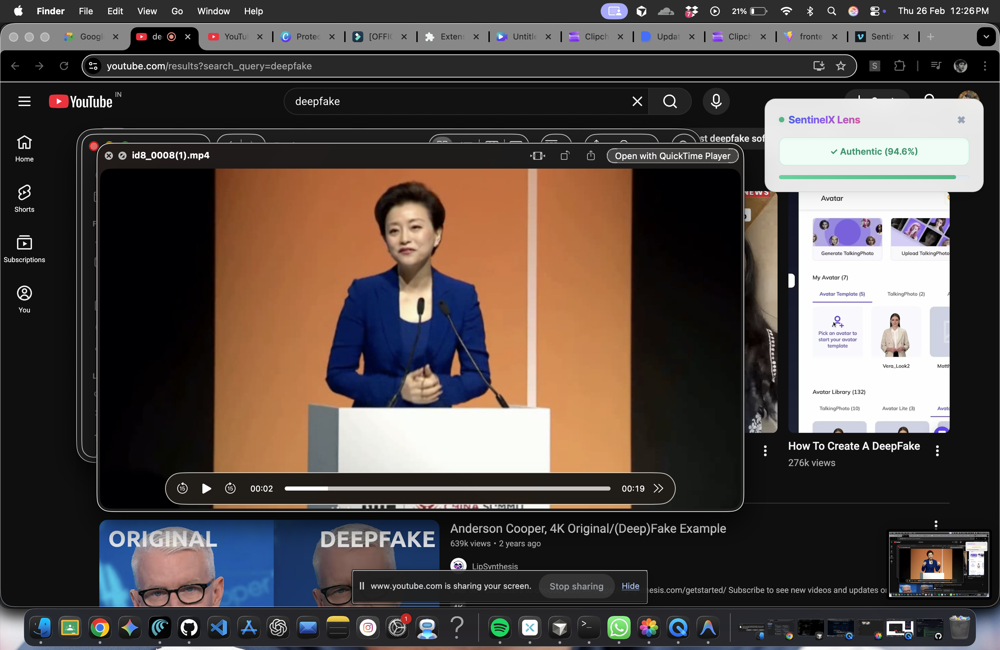

# 🛡️ SentinelX: Deepfake Shield

SentinelX is a state-of-the-art deepfake detection suite featuring a powerful real-time browser extension and a comprehensive analytics dashboard. Powered by a highly accurate, fine-tuned **Xception Neural Network (Epoch 25)**, SentinelX exposes AI-generated facial manipulations in any streaming video—including YouTube, Zoom, and Google Meet—without compromising your privacy.

---

## 🌟 Key Features

### 👁️ Real-Time Detection via Chrome Extension
Deploy the SentinelX Shield directly from your browser. By utilizing a manual screen-share capture architecture, SentinelX flawlessly bypasses cross-origin (CORS) restrictions natively built into major streaming platforms. It actively analyzes what you see on your screen.

**Live Analysis in Action:**
*(Save your images from our chat to an `assets` folder as `detection-fake.png`, `detection-real.png` to easily display them below!)*

<p align="center">
  
  
</p>

### 📊 Comprehensive Security Hub
Track all analyzed media via your personal Dashboard, featuring beautiful Glassmorphism UI elements, global statistics, and rapid sub-second neural evaluations.

<p align="center">
  
</p>

---

## ⚙️ Architecture and Technology Stack

- **Frontend Core:** React, Vite, Custom Premium CSS (Glassmorphism accents & vibrant color palette).
- **Extension Engine:** Manifest V3, Content-Script overlays, and Async communication.
- **Backend API:** FastAPI (Python), Motor (Asyncio MongoDB Driver), JWT Authentication.
- **AI Inference Engine:** Fine-tuned `xception` model operating locally via PyTorch. 
- **Video Pre-Processing:** OpenCV Haar Cascades for dynamic face cropping, eliminating background noise to prevent false positives and increase inference accuracy.

---

## 🚀 Installation & Setup

### 1. The Inference Backend (Python)
Ensure you have Python 3.10+ installed.

```bash
cd backend
python -m venv venv_gpu
# On Windows:
venv_gpu\Scripts\activate 
# On Mac/Linux:
# source venv_gpu/bin/activate

pip install -r requirements.txt
python main.py
```
*The local Neural Engine server will spin up on `http://localhost:8000`.*

### 2. The Dashboard (React Interface)
```bash
cd frontend
npm install
npm run build
```
*(The extension dynamically serves the built dashboard natively inside the browser).*

### 3. The Chrome Extension
1. Open Google Chrome.
2. Navigate to `chrome://extensions/`.
3. Enable **Developer Mode** in the top right.
4. Click **Load unpacked** and select the `/extension` directory in this repository.

---

## 👨‍💻 Authentication & Persistent Databases
The Python backend seamlessly integrates with an external MongoDB cluster and relies on heavily encrypted, hashed `bcrypt` passwords alongside secure JSON Web Tokens (JWT) to safeguard your private scanning history across sessions.

## 🛡️ Privacy First
SentinelX strictly relies on in-memory buffers. Frames are piped temporarily to the local neural engine and instantly destroyed. We do not store, export, or retain your raw videos.

## 📄 License
This project is licensed under the MIT License.
